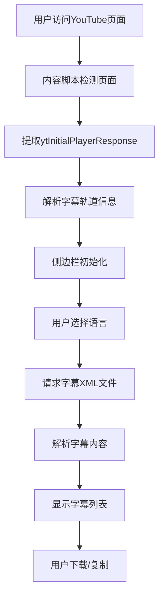
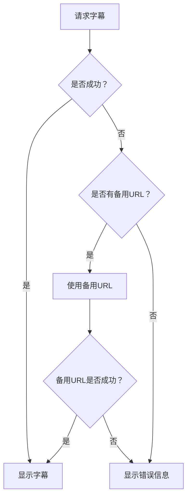

# YouTube 字幕下载技术实现方案

## 项目概述

### 项目背景
本项目是一个基于 Chrome 扩展的 YouTube 字幕下载工具，旨在为用户提供便捷的字幕获取和下载功能。项目通过直接解析 YouTube 页面数据来获取字幕信息，避免了官方 YouTube API 的限制。

### 技术目标
- 实现高效、稳定的字幕获取功能
- 支持多语言字幕和翻译字幕
- 提供用户友好的下载界面
- 确保系统的可靠性和可维护性

## 系统架构设计

### 整体架构
```
┌─────────────────┐    ┌─────────────────┐    ┌─────────────────┐
│   YouTube 页面  │───▶│   Chrome 扩展   │───▶│   用户界面     │
│                 │    │                 │    │                 │
│ • 播放器数据     │    │ • 内容脚本       │    │ • 侧边栏面板     │
│ • 字幕轨道信息   │    │ • 后台脚本       │    │ • 下载控制       │
│ • 视频元数据     │    │ • 消息传递       │    │ • 状态管理       │
└─────────────────┘    └─────────────────┘    └─────────────────┘
                                │
                                ▼
                       ┌─────────────────┐
                       │   分析服务      │
                       │                 │
                       │ • 使用统计      │
                       │ • 备用URL服务    │
                       │ • 配置管理      │
                       └─────────────────┘
```

### 核心组件

#### 1. Chrome 扩展组件
- **Manifest V3**: 现代扩展架构，提供更好的安全性和性能
- **Content Script**: 注入到 YouTube 页面，获取页面数据
- **Service Worker**: 后台服务，处理跨标签页通信
- **Side Panel**: 用户界面，基于 Vue.js 3 构建

#### 2. 数据处理组件
- **数据提取器**: 从 YouTube 页面解析播放器数据
- **字幕处理器**: 解析 XML 字幕文件，转换为可用格式
- **状态管理器**: 使用 Vue.js Composition API 管理应用状态

## 核心技术实现

### 1. 字幕数据获取机制

#### 1.1 页面数据提取
```javascript
// 核心正则表达式提取 ytInitialPlayerResponse
const extractPlayerResponse = (pageText) => {
    const match = pageText.match(/ytInitialPlayerResponse\s*=\s*({.+?})\s*;/);
    if (!match) {
        throw new Error("无法提取播放器响应数据");
    }
    return JSON.parse(match[1]);
};

// 获取页面 HTML 并解析
const fetchPageData = async (videoId) => {
    const response = await fetch(`https://www.youtube.com/watch?v=${videoId}`);
    const pageText = await response.text();
    return extractPlayerResponse(pageText);
};
```

#### 1.2 字幕轨道发现
```javascript
// 从播放器响应中提取字幕轨道信息
const extractCaptionTracks = (playerResponse) => {
    const captionTracks = playerResponse?.captions?.playerCaptionsTracklistRenderer?.captionTracks;
    
    if (!captionTracks || captionTracks.length === 0) {
        return null;
    }
    
    return captionTracks.map(track => ({
        baseUrl: track.baseUrl,
        languageCode: track.languageCode,
        name: track.name?.simpleText,
        isTranslatable: track.isTranslatable,
        kind: track.kind
    }));
};
```

#### 1.3 字幕 URL 构建
```javascript
// 构建字幕下载 URL
const buildSubtitleUrl = (captionTracks, targetLanguage, useAlternative = false) => {
    let subtitleUrl;
    
    if (useAlternative) {
        // 使用备用 URL 服务
        subtitleUrl = `https://antonkhoteev.com/khoteev-api/ysd/video/${videoId}/url`;
    } else {
        // 直接从 YouTube 获取
        const targetTrack = captionTracks.find(
            track => track.languageCode === targetLanguage
        );
        
        subtitleUrl = targetTrack?.baseUrl || captionTracks[0].baseUrl;
    }
    
    return new URL(subtitleUrl);
};

// 添加翻译参数
const addTranslationParams = (url, targetLanguage) => {
    const translationUrl = new URL(url);
    translationUrl.searchParams.append('tlang', targetLanguage);
    return translationUrl;
};
```

### 2. 字幕数据处理

#### 2.1 XML 字幕解析
```javascript
// 解析 YouTube XML 字幕格式
const parseYouTubeSubtitles = async (xmlText) => {
    const parser = new DOMParser();
    const xmlDoc = parser.parseFromString(xmlText, "application/xml");
    const textNodes = Array.from(xmlDoc.getElementsByTagName("text"));
    
    const formatTime = (timeInSeconds) => {
        const hours = Math.floor(timeInSeconds / 3600);
        const minutes = Math.floor((timeInSeconds % 3600) / 60);
        const seconds = Math.floor(timeInSeconds % 60);
        
        if (hours > 0) {
            return `${hours}:${String(minutes).padStart(2, '0')}:${String(seconds).padStart(2, '0')}`;
        }
        return `${String(minutes).padStart(2, '0')}:${String(seconds).padStart(2, '0')}`;
    };
    
    return textNodes.map((node, index) => {
        const start = parseFloat(node.getAttribute("start"));
        const duration = parseFloat(node.getAttribute("dur")) || 0;
        const end = start + duration;
        
        return {
            id: index + 1,
            start,
            end,
            duration,
            text: node.textContent.trim(),
            startTime: formatTime(start),
            endTime: formatTime(end)
        };
    });
};
```

#### 2.2 字幕格式转换
```javascript
// 转换为 SRT 格式
const convertToSRT = (subtitles) => {
    return subtitles.map((subtitle, index) => {
        return `${index + 1}\n${subtitle.startTime} --> ${subtitle.endTime}\n${subtitle.text}\n`;
    }).join('\n');
};

// 转换为 WebVTT 格式
const convertToWebVTT = (subtitles) => {
    let vttContent = 'WEBVTT\n\n';
    vttContent += subtitles.map(subtitle => {
        return `${subtitle.startTime} --> ${subtitle.endTime}\n${subtitle.text}\n`;
    }).join('\n');
    return vttContent;
};
```

### 3. 状态管理和用户界面

#### 3.1 Vue.js 状态管理
```javascript
// 使用 Composition API 管理状态
const useSubtitlesStore = defineStore('subtitles', () => {
    const subtitles = ref([]);
    const translations = ref([]);
    const isDownloading = ref(false);
    const originalLanguage = ref(null);
    const translateLanguage = ref(null);
    
    const mergedSubtitles = computed(() => {
        return mergeSubtitlesAndTranslations();
    });
    
    const fetchSubtitles = async () => {
        isDownloading.value = true;
        try {
            await fetchSubtitlesDirectYoutube();
            if (subtitles.value.length === 0) {
                await initAlternativeUrl();
                await fetchSubtitlesDirectYoutube();
            }
        } finally {
            isDownloading.value = false;
        }
    };
    
    return {
        subtitles,
        translations,
        isDownloading,
        mergedSubtitles,
        fetchSubtitles
    };
});
```

#### 3.2 用户界面组件
```vue
<template>
  <div class="subtitle-downloader">
    <div v-if="isDownloading" class="loading">
      <span>正在下载字幕...</span>
    </div>
    
    <div v-else>
      <div class="language-selector">
        <select v-model="originalLanguage">
          <option v-for="lang in availableLanguages" :value="lang.code">
            {{ lang.name }}
          </option>
        </select>
      </div>
      
      <div class="subtitle-list">
        <div v-for="subtitle in mergedSubtitles" :key="subtitle.id" 
             class="subtitle-item">
          <span class="time">{{ subtitle.startTime }}</span>
          <span class="text">{{ subtitle.text }}</span>
        </div>
      </div>
      
      <div class="actions">
        <button @click="downloadSubtitles" :disabled="isDownloading">
          下载字幕
        </button>
        <button @click="copySubtitles" :disabled="isDownloading">
          复制字幕
        </button>
      </div>
    </div>
  </div>
</template>
```

## 数据流处理流程

### 1. 主要数据流


### 2. 错误处理流程


## 关键技术细节

### 1. 正则表达式解析
```javascript
// 提取 ytInitialPlayerResponse 的核心正则表达式
const PLAYER_RESPONSE_REGEX = /ytInitialPlayerResponse\s*=\s*({.+?})\s*;/;

// 增强版本，处理不同的格式变化
const ENHANCED_PLAYER_RESPONSE_REGEX = 
    /ytInitialPlayerResponse\s*=\s*({.+?})\s*;|window\["ytInitialPlayerResponse"\]\s*=\s*({.+?})\s*;/;
```

### 2. 异步处理优化
```javascript
// 并行处理多个请求
const fetchMultipleSubtitles = async (captionTracks, languages) => {
    const promises = languages.map(async (lang) => {
        const track = captionTracks.find(t => t.languageCode === lang);
        if (track) {
            const response = await fetch(track.baseUrl);
            return {
                language: lang,
                content: await response.text()
            };
        }
        return null;
    });
    
    return Promise.all(promises);
};

// 带超时的请求
const fetchWithTimeout = async (url, timeout = 5000) => {
    const controller = new AbortController();
    const timeoutId = setTimeout(() => controller.abort(), timeout);
    
    try {
        const response = await fetch(url, { signal: controller.signal });
        clearTimeout(timeoutId);
        return response;
    } catch (error) {
        clearTimeout(timeoutId);
        throw new Error(`请求超时: ${error.message}`);
    }
};
```

### 3. 内存管理
```javascript
// 清理不再需要的数据
const cleanupSubtitleData = () => {
    subtitles.value = [];
    translations.value = [];
    youtubeObject.value = null;
};

// 使用 WeakRef 管理大型对象
const createWeakRef = (obj) => {
    return new WeakRef(obj);
};

// 定期清理内存
const setupMemoryCleanup = () => {
    setInterval(() => {
        if (performance.memory) {
            const memoryInfo = performance.memory;
            if (memoryInfo.usedJSHeapSize > memoryInfo.jsHeapSizeLimit * 0.9) {
                cleanupSubtitleData();
            }
        }
    }, 30000); // 每30秒检查一次
};
```

## 错误处理和容错机制

### 1. 网络错误处理
```javascript
// 重试机制
const fetchWithRetry = async (url, maxRetries = 3) => {
    for (let i = 0; i < maxRetries; i++) {
        try {
            return await fetchWithTimeout(url);
        } catch (error) {
            if (i === maxRetries - 1) {
                throw new Error(`获取失败，已重试 ${maxRetries} 次`);
            }
            await new Promise(resolve => setTimeout(resolve, 1000 * (i + 1)));
        }
    }
};

// 网络状态检测
const checkNetworkStatus = () => {
    return navigator.onLine;
};

// 网络状态监听
const setupNetworkListeners = () => {
    window.addEventListener('online', () => {
        console.log('网络连接已恢复');
    });
    
    window.addEventListener('offline', () => {
        console.log('网络连接已断开');
    });
};
```

### 2. 数据验证
```javascript
// 验证字幕数据
const validateSubtitleData = (subtitles) => {
    if (!Array.isArray(subtitles)) {
        throw new Error('字幕数据格式错误');
    }
    
    return subtitles.every(subtitle => 
        typeof subtitle.id === 'number' &&
        typeof subtitle.start === 'number' &&
        typeof subtitle.end === 'number' &&
        typeof subtitle.text === 'string'
    );
};

// 验证 XML 数据
const validateXmlData = (xmlText) => {
    try {
        const parser = new DOMParser();
        const xmlDoc = parser.parseFromString(xmlText, "application/xml");
        const parseError = xmlDoc.getElementsByTagName('parsererror')[0];
        return !parseError;
    } catch (error) {
        return false;
    }
};
```

## 性能优化策略

### 1. 缓存机制
```javascript
// 简单的内存缓存
const subtitleCache = new Map();

const getCachedSubtitles = (videoId, language) => {
    const cacheKey = `${videoId}_${language}`;
    return subtitleCache.get(cacheKey);
};

const setCachedSubtitles = (videoId, language, subtitles) => {
    const cacheKey = `${videoId}_${language}`;
    subtitleCache.set(cacheKey, {
        data: subtitles,
        timestamp: Date.now()
    });
    
    // 设置缓存过期时间（1小时）
    setTimeout(() => {
        subtitleCache.delete(cacheKey);
    }, 60 * 60 * 1000);
};
```

### 2. 虚拟滚动优化
```javascript
// 虚拟滚动实现
const useVirtualScroll = (containerRef, itemHeight, itemCount) => {
    const scrollTop = ref(0);
    const visibleItems = computed(() => {
        const start = Math.floor(scrollTop.value / itemHeight);
        const end = Math.min(start + 20, itemCount); // 显示20个项目
        return { start, end };
    });
    
    const onScroll = () => {
        if (containerRef.value) {
            scrollTop.value = containerRef.value.scrollTop;
        }
    };
    
    return {
        scrollTop,
        visibleItems,
        onScroll
    };
};
```

### 3. 批处理优化
```javascript
// 批量处理字幕数据
const batchProcessSubtitles = (subtitles, batchSize = 100) => {
    const batches = [];
    for (let i = 0; i < subtitles.length; i += batchSize) {
        batches.push(subtitles.slice(i, i + batchSize));
    }
    return batches;
};

// 异步批处理
const processBatchAsync = async (batches, processor) => {
    const results = [];
    for (const batch of batches) {
        const batchResults = await Promise.all(
            batch.map(item => processor(item))
        );
        results.push(...batchResults);
        
        // 让出主线程
        await new Promise(resolve => setTimeout(resolve, 0));
    }
    return results;
};
```

## 安全考虑

### 1. 数据安全
```javascript
// 输入验证
const sanitizeInput = (input) => {
    return input.replace(/[<>]/g, '');
};

// 防止 XSS 攻击
const escapeHtml = (text) => {
    const div = document.createElement('div');
    div.textContent = text;
    return div.innerHTML;
};
```

### 2. 权限管理
```javascript
// 检查扩展权限
const checkPermissions = async () => {
    const requiredPermissions = ['storage', 'sidePanel', 'tabs'];
    const hasPermissions = await chrome.permissions.contains({
        permissions: requiredPermissions
    });
    
    if (!hasPermissions) {
        console.warn('缺少必要权限');
    }
    
    return hasPermissions;
};
```

## 部署和维护

### 1. 扩展打包
```json
{
  "manifest_version": 3,
  "name": "YouTube Subtitle Downloader",
  "version": "1.1.3",
  "description": "Download YouTube subtitles easily",
  "permissions": ["storage", "sidePanel", "tabs"],
  "host_permissions": ["https://antonkhoteev.com/*"],
  "content_scripts": [{
    "matches": ["*://www.youtube.com/*"],
    "js": ["src/content.js"]
  }],
  "background": {
    "service_worker": "src/background.js",
    "type": "module"
  }
}
```

### 2. 更新机制
```javascript
// 检查更新
const checkForUpdates = async () => {
    try {
        const response = await fetch('https://antonkhoteev.com/khoteev-api/ysd/version');
        const latestVersion = await response.json();
        const currentVersion = chrome.runtime.getManifest().version;
        
        if (latestVersion !== currentVersion) {
            console.log('发现新版本，建议更新');
        }
    } catch (error) {
        console.error('检查更新失败:', error);
    }
};
```

## 监控和分析

### 1. 使用统计
```javascript
// 发送使用统计
const sendUsageStats = async (action) => {
    try {
        const statsUrl = new URL('https://antonkhoteev.com/khoteev-api/ysd/stats');
        statsUrl.searchParams.append('action', action);
        statsUrl.searchParams.append('timestamp', Date.now().toString());
        
        await fetch(statsUrl, { method: 'POST' });
    } catch (error) {
        console.error('发送统计信息失败:', error);
    }
};
```

### 2. 错误监控
```javascript
// 错误报告
const reportError = async (error, context) => {
    try {
        const errorUrl = new URL('https://antonkhoteev.com/khoteev-api/ysd/error');
        errorUrl.searchParams.append('message', error.message);
        errorUrl.searchParams.append('stack', error.stack);
        errorUrl.searchParams.append('context', JSON.stringify(context));
        
        await fetch(errorUrl, { method: 'POST' });
    } catch (reportError) {
        console.error('错误报告失败:', reportError);
    }
};
```

## 未来优化方向

### 1. 技术改进
- **Web Workers**: 将 XML 解析移至 Worker 线程，避免阻塞主线程
- **Service Worker Cache**: 实现更强大的缓存机制
- **IndexedDB**: 存储历史字幕数据，支持离线访问
- **WebAssembly**: 使用 WASM 加速 XML 解析

### 2. 功能扩展
- **批量下载**: 支持播放列表批量字幕下载
- **格式转换**: 支持更多字幕格式（ASS、SSA 等）
- **字幕编辑**: 内置简单的字幕编辑功能
- **云端同步**: 支持字幕数据的云端存储和同步

### 3. 用户体验
- **主题定制**: 支持深色模式和自定义主题
- **快捷键支持**: 添加键盘快捷键操作
- **预览功能**: 实时预览字幕效果
- **多语言界面**: 支持界面多语言切换

## 总结

本技术实现方案详细介绍了 YouTube 字幕下载的核心技术架构和实现细节。通过直接解析 YouTube 页面数据的方式，巧妙地避开了官方 API 的限制，为用户提供了稳定可靠的字幕下载服务。

系统采用了多层容错机制、性能优化策略和安全防护措施，确保了在各种网络环境下的稳定运行。同时，通过模块化的设计和清晰的代码结构，为后续的功能扩展和维护提供了良好的基础。

未来，随着技术的不断发展和用户需求的变化，该系统还可以在性能、功能和用户体验等方面进行进一步的优化和提升。